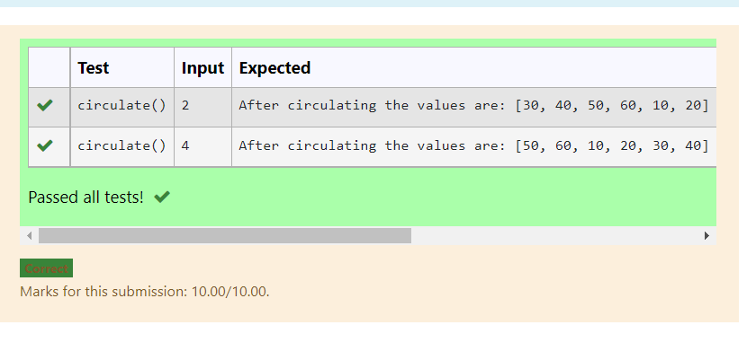

# Circulate-the-values-of-N-variables
## Aim:
To write a python program to circulate the n variables using function concept
## Equipment’s required:
PC
Anaconda - Python 3.7
## Algorithm: 

### Step 1:  
Get the values from the user
### Step 2: 
Assign thr value of x variable 
### Step 3
Get the value from the user for the number of rotation
### Step 4: 
Using the slicing concept rotate the list

### Step 5: 
Print the values it would be calculated
### Step 6: 
End the program
## Program:
~~~
#Program to circulate N values.
#Developed by: ezhilmathi r 
#RegisterNumber: 21500766
def circulate():
    num1=[10,20,30,40,50,60]
    n=int(input())
    result=num1[n:]+num1[:n]
    print("After circulating the values are:",result)
 ~~~

## Output:

## Result: 
   Thus,a python program to circulate the n variables using function concept is executed successfully.
